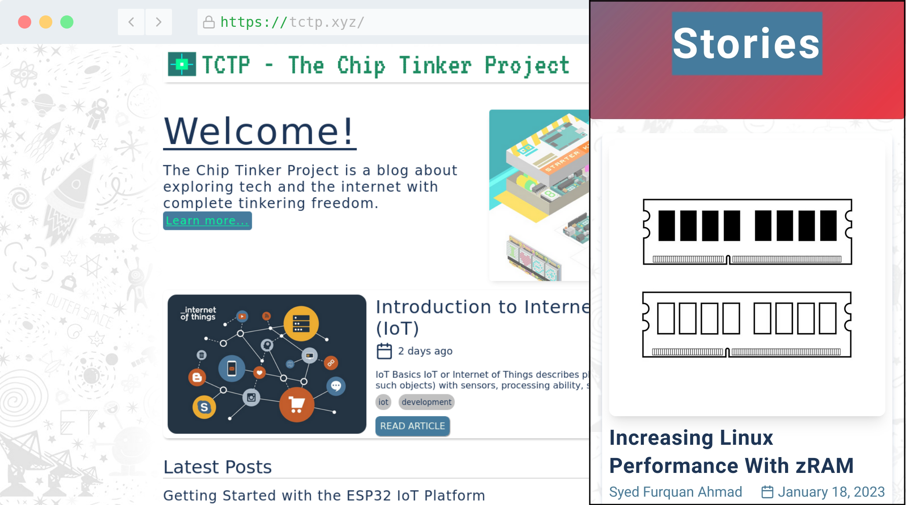

# TCTP.xyz - The Chip Tinker Project
This repository contains the source code for my blog at https://tctp.xyz/

## Features:
* Built using [Gatsby](https://www.gatsbyjs.com/), React and [Tailwind CSS](https://tailwindcss.com/)
* Uses [Netlify CMS](https://www.netlifycms.org/) for posting and managing blog content
* Powered by a [Netlify](https://www.netlify.com/) backend

## Legal:
Permission to use, copy, modify, and/or distribute this software for any purpose with or without fee is hereby granted.
See [LICENSE](LICENSE) for more details. Images may be subject to copyright, allowance is made for
"[fair use](https://en.wikipedia.org/wiki/Fair_use)" for non-profit, educational or personal purposes.