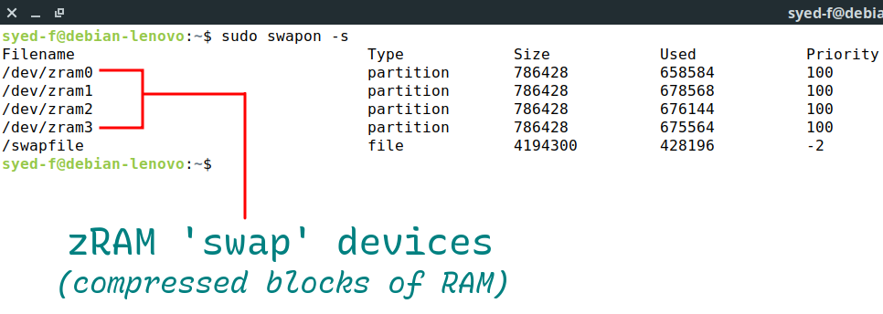
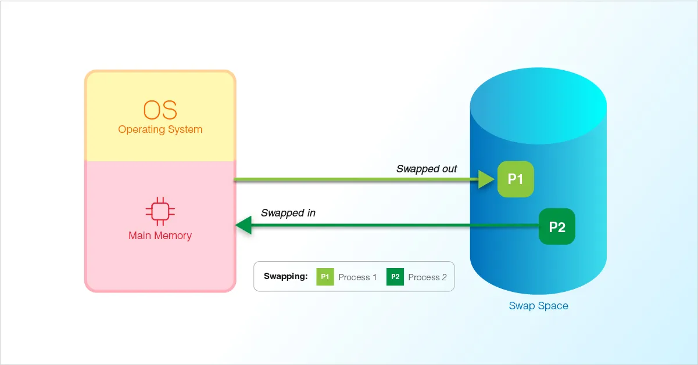
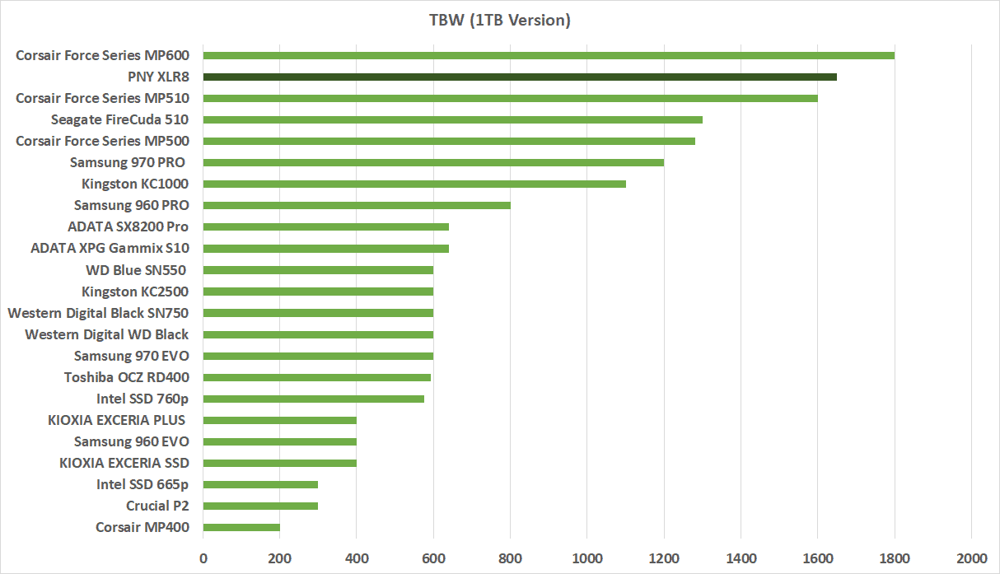
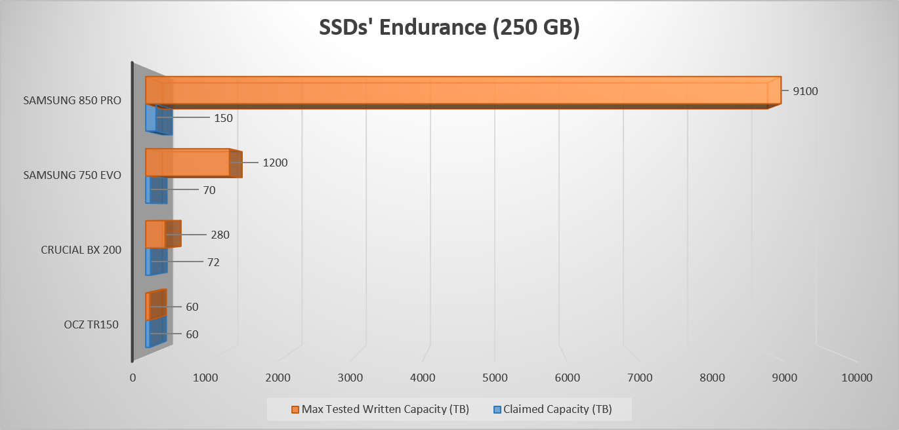

# Increasing Linux Desktop/Server Performance with RAM Compression Using zRAM

Linux has always offered a highly customizable environment, both on server and on desktop. In this blog post we'll be taking a look at how we can increase the _swap_ performance by using compressed RAM blocks called "zRAM" that both conserve memory and enable high performance I/O and disk caching.



## What is swap?

Without going into too many details, swap is a space on a _device_ (which is usually a disk, among other things) for 'swapping' out pages (small blocks of memory) that can't be dropped without losing data. _Usually_, swap is a storage space for these blocks of memory that serves as an alternative to keeping these in physical memory (i.e. the 'RAM').

Contrary to common misconceptions, swap is _not_ an 'extension' of physical memory, rather an alternative to keeping modified page cache in RAM. So even with enough free memory, some swap may be used and usage will increase with increasing memory use as can be seen in [this article](https://www.redhat.com/en/blog/do-we-really-need-swap-modern-systems) from RedHat showing the behavior of a system with 2GB of RAM and a 2GB swap device on a hard disk.



So why is swap being used even when there's plenty of free memory? Quoting from the same RedHat blog post:

> Now we start processes, requesting and writing to only a small part of RAM, and reading data from disk. As our RAM would otherwise be unused, the kernel is using it to cache the data we are reading. If data is requested a second time, it is available from the cache.

## The problem with swap on a disk

Disk I/O isn't great and unsurprisingly swapping out pages to a swap device on a disk is often slow. _Unusably_ slow when the swap device is on a hard disk. Many a Linux user would know that running out of memory on a system with swap on a hard disk is a painful experience commonly involving a system freezing up for a fairly long time before the kernel _OOM killer_ has a chance to kick in.

Swap on an SSD isn't good either. While swapping pages to a fast I/O device like an SSD is not so bad, the frequent random (or large sequential) read-writes aren't good for the health of the SSD. It increases the wear-level as more bytes are read from and written to the disk. Manufacturers promise a certain TBW (total bytes written) and the count can be found in the SMART data as `Total_LBAs_Written` but we have no way of knowing exactly how much a SSD can take.



SSD and other flash memory have a finite lifespan and since it's fairly new technology compared to old hard disks, we have no long time real world data on how the various factors exactly affect the lifespan of the disk.



## Enter zRAM


From the Wikipedia article on zRAM:

> zram, formerly called compcache, is a Linux kernel module for creating a compressed block device in RAM, i.e. a RAM disk with on-the-fly disk compression. The block device created with zram can then be used for swap or as general-purpose RAM disk.

zRAM essentially takes the previously mentioned unreclaimable pages (that we can't drop) and _swaps_ them out to a compressed block device present in RAM, the physical memory. This can basically **double** the RAM in the best case scenarios depending on the size of the zRAM device(s) and how compressible the pages being swapped are.

The compression has a slight overhead of course, but with modern processors, multi threading and efficient compression algorithms, it is trivial compared to the benefits. Speaking of compression, zRAM supports multiple compression algorithms but we'll be only concerning ourselves with [LZ4](https://en.wikipedia.org/wiki/LZ4_(compression_algorithm)) and [zstd](https://en.wikipedia.org/wiki/Zstd) both of which have minimal overhead and good compression ratios.

## Setting up

Some Linux distributions like Fedora and ChromeOS already have zRAM set up but most don't (a large part of how ChromeOS manages to run on such low memory devices is the zram setup). You can check for `/dev/zram[0-9]` devices if you're unsure. So how exactly do we set up zRAM? First we want to become root for the whole process.

```
$ sudo -i
```

Then we need to probe the zram module with `modprobe`. This is where we can also decide on the total number of zram devices we need. Common online wisdom seems to indicate that most people stick with only one zram device but we want to take advantage of load balancing and parallelization because we aren't actually using a traditional swap device (where multiple devices may hinder performance). A good rule of thumb is to use as many zram devices as you have cpu _cores_ available.

```
# modprobe zram num_devices=4
```

Now we need to set up the compression algorithm we'll be using and the size of the individual zram devices. There are many compression algorithms available but we need to only care about _LZ4_ and _zstd_. Both of these are comparable but zstd may have better compression ratios at the cost of slightly increased overhead. I'll be using LZ4 for this example but feel free to use zstd. As for the size of the zram devices, we'll just divide the size of zram we want by the number of devices. So if I want 4GB of zram with `num_devices=4` (on a quad-core system), I'll set the size of each zram device to `1G`.

```
# echo lz4 > /sys/block/zram0/comp_algorithm
# echo 1G > "/sys/block/zram0/disksize
```

We want to do this process for _every_ zram device we have which can be tedious so let's automate things a bit with a `for` loop.

```
# for i in {0..3}
do
echo lz4 > "/sys/block/zram$i/comp_algorithm"
echo 768M > "/sys/block/zram$i/disksize"
done
```

## Creating swap and using zRAM

Now all that's left is to create swap areas on the zram devices and begin swapping off of them. So let's set up the swap area(s):

```
# mkswap --label zram0 /dev/zram0
```

And begin swapping off of the zram device(s):

```
# swapon --priority 100 /dev/zram0
```

Typically you want a higher swap priority for the zram devices compared to disk swap since we want the system to use the zram devices as much as possible and only swap to the disk in overflow cases. Of course this doesn't matter if you have no disk swap at all. Actually some people do seem to use zRAM with no disk swap at all, I wouldn't advise that since zram devices aren't like typical swap on the disk and OOM scenarios can be just as disastrous for the system.

As before, we can automate the above process with a `for` loop.

```
# for i in {0..3}
do
mkswap --label "zram$i" "/dev/zram$i"
swapon --priority 100 "/dev/zram$i"
done
```